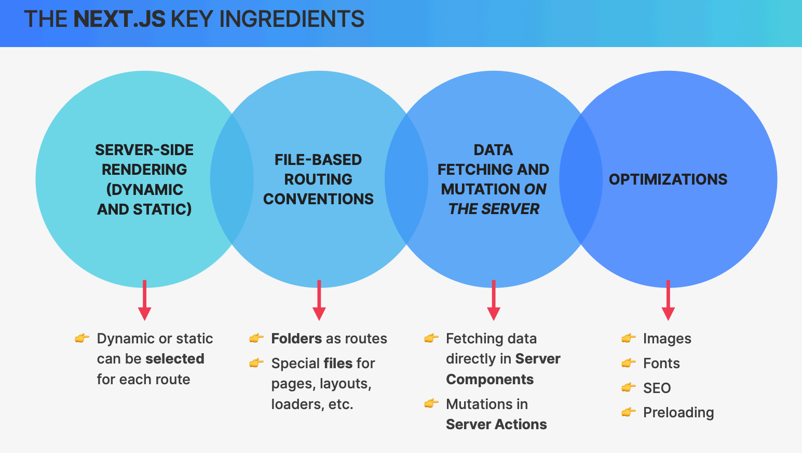
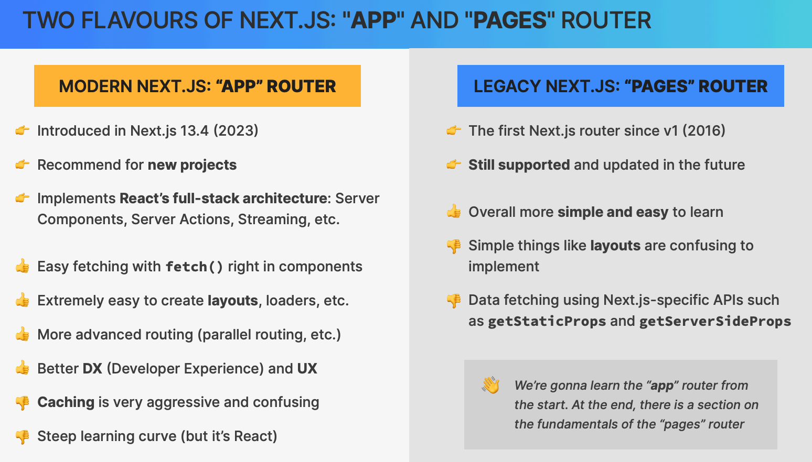
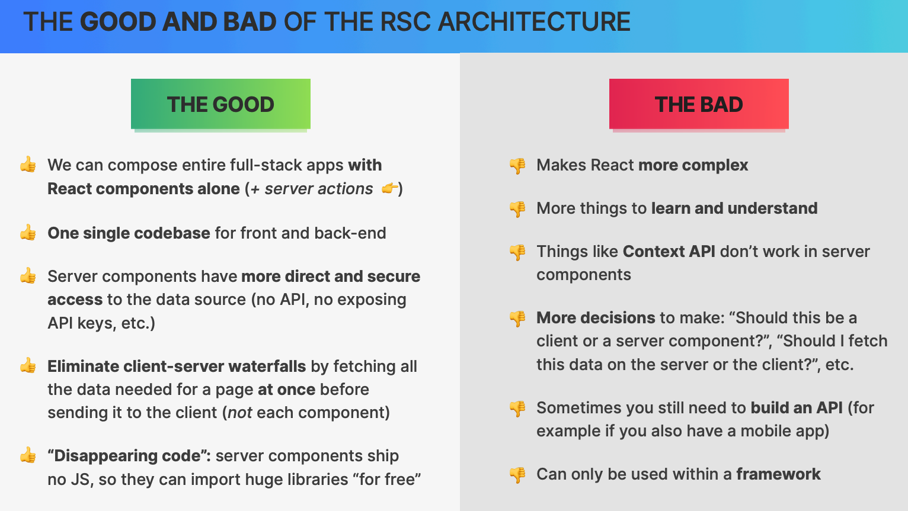
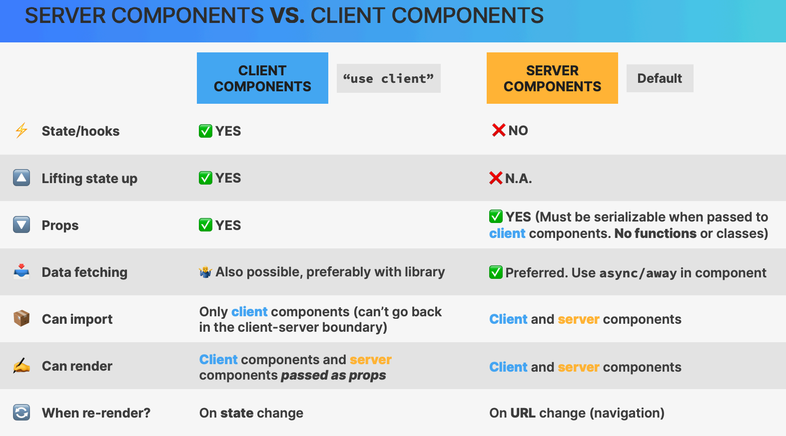
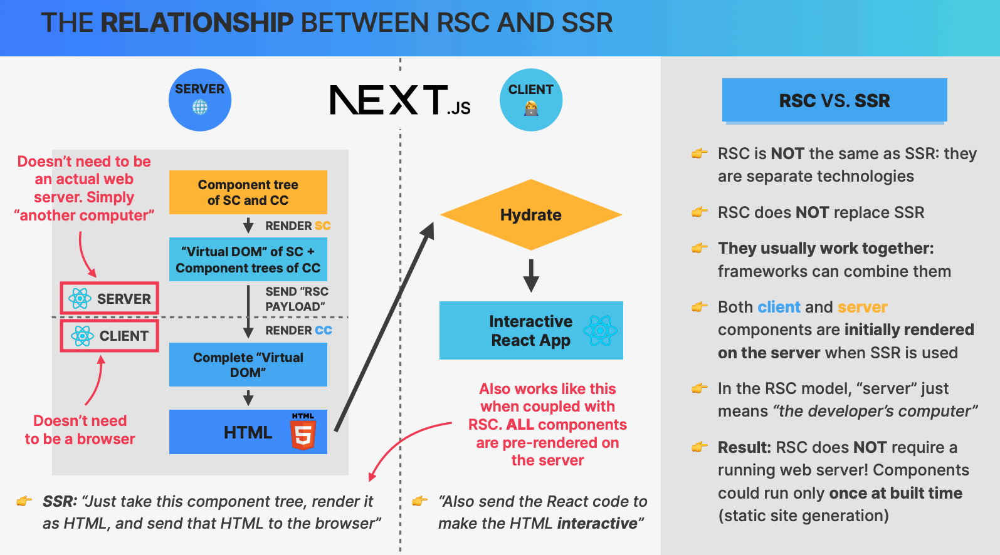
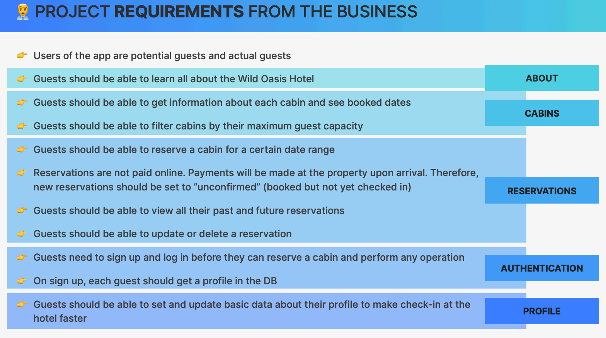
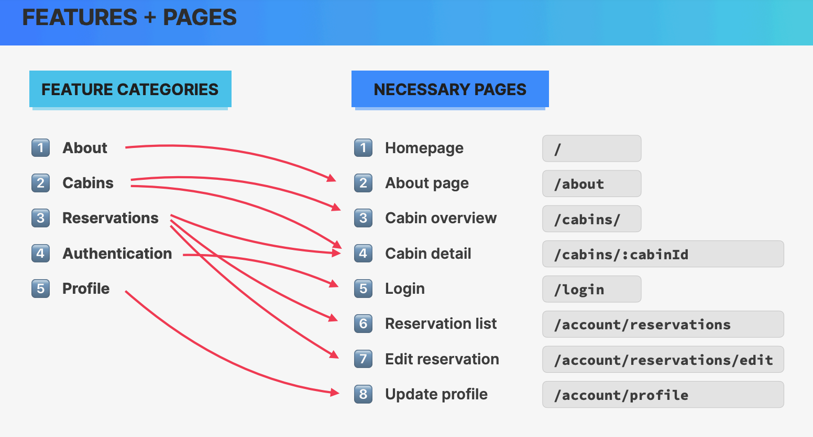
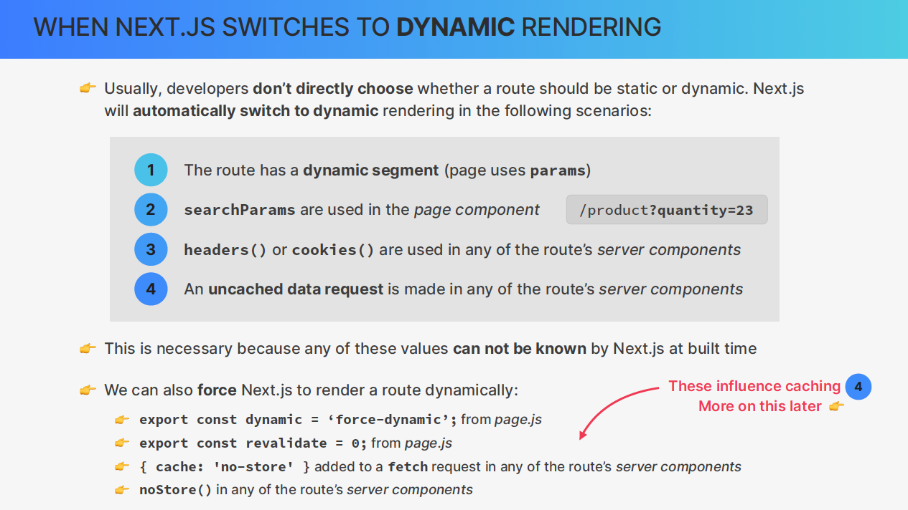

This is a [Next.js](https://nextjs.org/) project bootstrapped with [`create-next-app`](https://github.com/vercel/next.js/tree/canary/packages/create-next-app).

## Getting Started

First, run the development server:

```bash
npm run dev
# or
yarn dev
# or
pnpm dev
# or
bun dev
```

Open [http://localhost:3000](http://localhost:3000) with your browser to see the result.

You can start editing the page by modifying `app/page.js`. The page auto-updates as you edit the file.

This project uses [`next/font`](https://nextjs.org/docs/basic-features/font-optimization) to automatically optimize and load Inter, a custom Google Font.

## Learn More

To learn more about Next.js, take a look at the following resources:

- [Next.js Documentation](https://nextjs.org/docs) - learn about Next.js features and API.
- [Learn Next.js](https://nextjs.org/learn) - an interactive Next.js tutorial.

You can check out [the Next.js GitHub repository](https://github.com/vercel/next.js/) - your feedback and contributions are welcome!

## Deploy on Vercel

The easiest way to deploy your Next.js app is to use the [Vercel Platform](https://vercel.com/new?utm_medium=default-template&filter=next.js&utm_source=create-next-app&utm_campaign=create-next-app-readme) from the creators of Next.js.

Check out our [Next.js deployment documentation](https://nextjs.org/docs/deployment) for more details.

#

# OASIS HOTEL

- NEXT DOC's https://nextjs.org/docs

### IMAGES

<h3>IMPROVEMENTS</h3>


<h3>NEXT APP OR PAGE ROUTER</h3>


<h3>RSC ARCHITECTURE</h3>


<h3>SERVER X CLIENT</h3>


<hr/>

<h3>RSC & RSS</h3>


<h3>REQUIREMENTS</h3>


<h3>FEATURES PAGES</h3>


### HEROICONS/REACT

```
npm i @heroicons/react
```

### META DATA

<p><strong>%s</strong> will get replaced by wherever the title I pass in each page </p>

```
export const metadata = {
  title: {
    template: '%s / The Oasis Hotel',
    default: 'Welcome / The Oasis Hotel',
  },
}
```

OBS: \* Each page should have it's own metadata function.

### FAV ICON

<p>By convention, Next.js set the fav-icon automatically if I set an image with name <strong>icon</strong>. The type can be anything but the name must be <strong>icon</strong></p>

### NEXT FONTS

<h3>LOCAL</h3>

```
import localFont from '@next/font/local'
const myFont = localFont({src: './my-font.woff2'})
```

<h3>FROM GOOGLE</h3>

LINK: https://nextjs.org/docs/pages/building-your-application/optimizing/fonts

```
import {Josefin_Sans} from 'next/font/google'
<element className={`${josefinSans.className}`}></element>
```

### SUPABASE INPLEMENT

```
npm i @supabase/supabase-js
```

<h3>ENVIRONMENT VARIABLES</h3>

- [NEXT_PUBLIC_] prefix leaks the info to the server and client side. (Be carefull)

- Without [NEXT_PUBLIC_] prefix the variable is available only for local environment

### SUSPENSE

<p>The Suspense component in Next.js is a React feature that allows you to display a fallback UI while waiting for some asynchronous operation to complete, such as data fetching or code splitting. This is particularly useful for improving user experience by showing a loading indicator or placeholder content instead of a blank screen.</p>

<p>The Suspense needs to be outside of the component that is being fetched</p>

```
  <Suspense fallback={<Spinner />}>
    <CabinList />
  </Suspense>
```

### GENERATE METADATA

```
  // needs to be called generateMetadata
  export async function generateMetadata({ params }) {
  const cabin = await getCabin(params.cabinId)
    return {
      title: `Cabin ${cabin.name}`,
      description: `Cabin details page`,
    }
}
```

### NOT-FOUND PAGE

- Can be called in a fetch function to return a not-found page

```
import { notFound } from 'next/navigation'


  if(error) {
    notFound()
  }
```

- notFound() will trigger the not-found page

### DYNAMIC RENDERING TO STATIC RENDERING

<hr/>


<p>cabinId is dynamic, so it's rendered dynamically because it uses the params as a props.</p>
<p>To convert to static rendering, we need to generateStaticParams() function, that will return an array of cabinId's, like this: </p>

```
export async function generateStaticParams() {
  const cabins = await getCabins()
  return cabins.map((cabin) => ({
    cabinId: toString(cabin.id),
  }))
}
```

- It will improve the performance!

### SSG - Static Site Generation

In next.config.mjs, we set the output to export, so the app will be built as a static site.

### ISR - Incremental Static Regeneration / Revalidate

```
export const revalidate = 3600 // In seconds (1 hour)
```

### UNSTABLE_NOSTORE / NOSTORE

```
import { unstable_noStore as noStore } from 'next/cache'

noStore()

```

### Params & SearchParams

1- function Page({ params }) => params gets the ID from url
ex: https://www.website.com/cabin/29 id = 29

2 -function Page({ searchParams }) => gets the search params from url
ex: https://www.website.com/cabin?capacity=small  
returns {capacity: ’small’}

PS: Only available in Pages not in Server Components!

<h4>useSearchParams & useRouter Hooks</h4>

### INSTALL react-day-picker

```
npm install react-day-picker
```

<hr/>

### NEXT API ROUTES - NextResponse

LINK: https://developer.mozilla.org/en-US/docs/Web/API/Response

### NEXT AUTH JS

```
npm install next-auth@beta
```
